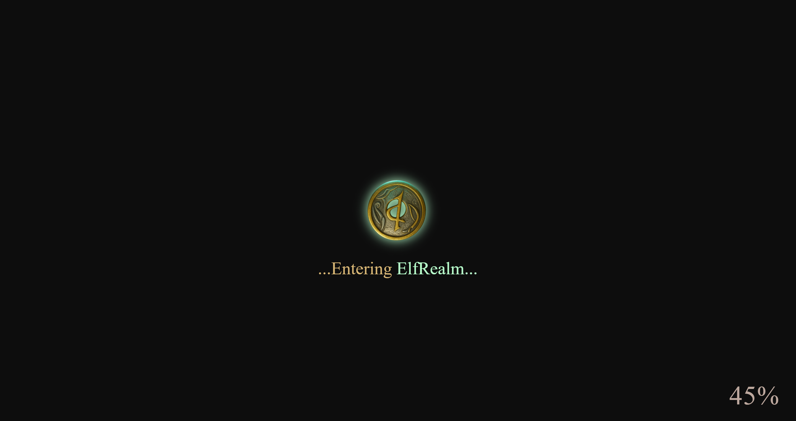
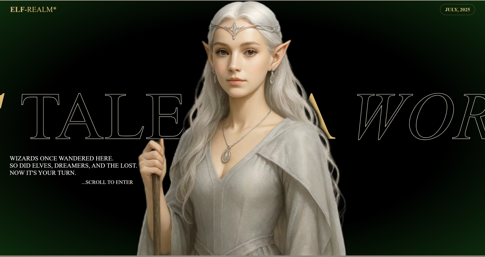
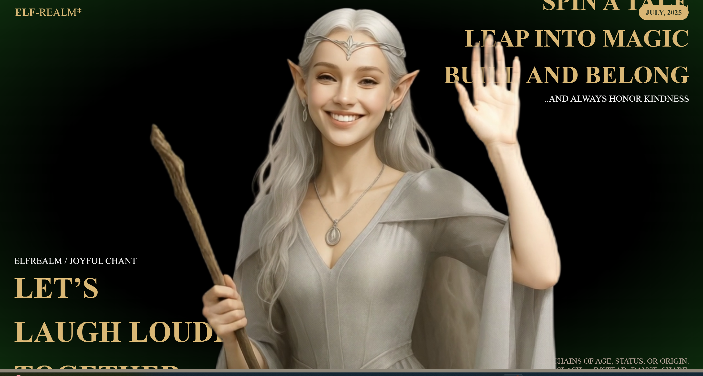
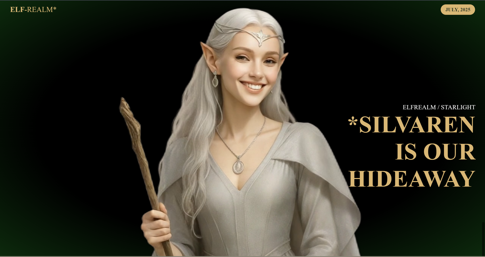

An immersive elven-themed website with scroll animations.
# 🧝‍♀️ ElfRealm

**ElfRealm** is a magical, immersive web experience inspired by elven fantasy realms. With scroll-triggered canvas animations, ambient sound effects, elvish runes, and rich visuals, this project creates a visually captivating world straight from folklore.

## ✨ Features

- 🌄 Scroll-controlled canvas animation using **GSAP** and **ScrollTrigger**
- 📱 Separate animations for desktop and mobile
- 🔮 Elvish-themed loading spinner and glowing runes
- 🎵 Ambient music and subtle sound effects
- 🧭 Scroll cues for better user navigation
- ⚙️ Responsive design and optimized performance

## 🛠️ Tech Stack

- **HTML5**, **CSS3**, **JavaScript**
- **GSAP** with **ScrollTrigger**
- **Locomotive Scroll** for smooth scrolling
- **Canvas** for frame-by-frame animation
- **Photoshop/Illustrator** (for elven assets and runes)

## 🚀 How to Run Locally

```bash
git clone https://github.com/neha23jk/ELFrealm.git
cd ELFrealm
# Open index.html in your browser
```
##🧙‍♀️ Inspiration
This site was inspired by the elegance and mysticism of elvish lore in fantasy literature, movies, and games like The Lord of the Rings and Skyrim.

##📄 License
Apache 2.0 License

##🌟 Made with magic by Neha Chaudhary

## 🖼️ Screenshots

Here are a few glimpses of **ElfRealm** in action:

### 🔮 Elvish Rune & Loader


### 🌄 Landing Page


### 🧝‍♀️ Scroll Animation



